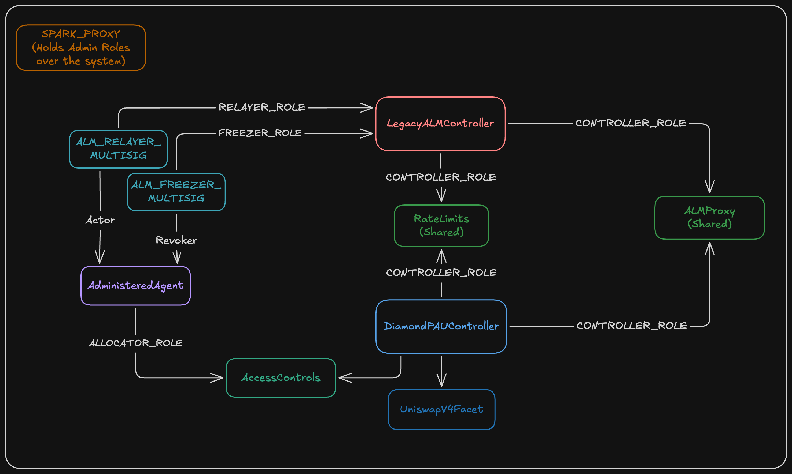

# Parallel Controller Upgrade: Diamond PAU with UniswapV4Facet

This document describes a staged first step for onboarding the Diamond PAU system on Ethereum mainnet
alongside the existing (legacy) ALM Controller. Both controllers custody the same `ALMProxy` and both
write to the same `RateLimits` contract. The new Diamond PAU Controller is wired with exactly one
integration, `UNISWAP_V4_FACET`, and nothing else.

The intent of the staged approach is to bring the Diamond PAU architecture into production behind a
narrow, well understood integration, without migrating funds, without redeploying the custody
contract, and without changing how the legacy controller currently operates.

The central property this document needs to make explicit for risk planning:

> The Diamond PAU Controller holds the `CONTROLLER` role on the `ALMProxy`, which confers unrestricted
> authority over the full `ALMProxy` balance. It is constrained **not** by the proxy, but by the set
> of call selectors wired into it (Uniswap V4 only) and by the rate limits attached to those specific
> functions.

---

## 1. Target topology

<p align="center">
  
</p>

`ALLOCATOR_ROLE` is held by the `AdministeredAgent` on `AccessControls`, not on the Controller itself.
The Controller and its facets hold no role state of their own: every `onlyRole` check, for both
`ALLOCATOR_ROLE` and `DEFAULT_ADMIN_ROLE`, is an external call into `AccessControls`. This is the
structural difference from the legacy controller, which stores `RELAYER` and `FREEZER` internally.

One contract is omitted from the diagram for readability but is part of the deployment: `Beacon`, the
canonical registry of integration configs (facet address plus selector wiring). The Controller syncs
its local dispatch table from the Beacon via `updateIntegrations`, and the Beacon is the only place the
`UniswapV4Facet` address is registered.

### 1.1 Contract inventory

**Reused, unchanged:**

| Contract | Mainnet address | Change |
| --- | --- | --- |
| `ALMProxy` | `0x1601843c5E9bC251A3272907010AFa41Fa18347E` | One `grantRole(CONTROLLER, diamondController)` |
| `RateLimits` | `0x7A5FD5cf045e010e62147F065cEAe59e5344b188` | One `grantRole(CONTROLLER, diamondController)`, plus new UniV4 keys |
| `MainnetController` (legacy) | `0x5c46Fc65855c0C7465a1EA85EEA0B24B601502D3` | None |
| `SPARK_PROXY` | `0x3300f198988e4C9C63F75dF86De36421f06af8c4` | None, remains admin everywhere |
| `ALM_RELAYER_MULTISIG` | `0x8a25A24EDE9482C4Fc0738F99611BE58F1c839AB` | Additionally becomes agent Actor |
| `ALM_BACKSTOP_RELAYER_MULTISIG` | `0x8Cc0Cb0cfB6B7e548cfd395B833c05C346534795` | Additionally becomes agent Actor |
| `ALM_FREEZER_MULTISIG` | `0x90D8c80C028B4C09C0d8dcAab9bbB057F0513431` | Additionally becomes agent Revoker |

**Already deployed, reused unchanged:** the Diamond PAU core infrastructure and the `UniswapV4Facet`
are live on mainnet. Addresses from
[`sky-pau-registry/src/Ethereum.sol`](https://github.com/sky-ecosystem/sky-pau-registry/blob/master/src/Ethereum.sol),
which is the canonical source of truth.

| Contract | Mainnet address | Role in this upgrade |
| --- | --- | --- |
| `Beacon` | `0x829dC2b7E94B1954F0764E573f2E0d45Afa28199` | Holds the `UNISWAP_V4_FACET` integration config the Controller syncs from |
| `PAUFactory` | `0x69A5d548830AC2A4Ba90A44a2C75BDA71f97fc66` | Deploys the new `AccessControls` and `Controller` |
| `AdministeredAgentFactory` | `0x2968c3b5478cF93B70aB1e24255d4EDBBd27a089` | Deploys the new `AdministeredAgent` |
| `UniswapV4Facet` | `0x75D35ffB8e6B871E12EB549CcF6afD324c46E47D` | The only integration wired into the new Controller |
| `DefaultPAUAssembler` | `0xc812aAD3FaE2D3511C664374B601a9BeBFeCCa2E` | Not used here, see section 5 |

**Still to be deployed:**

| Contract | Source | Notes |
| --- | --- | --- |
| `AccessControls` | via `PAUFactory.deployAccessControls` | Admin: `SPARK_PROXY`. |
| `Controller` (Diamond PAU) | via `PAUFactory.deployController` | Points at the **existing** `ALMProxy` and **existing** `RateLimits`. |
| `AdministeredAgent` | via `AdministeredAgentFactory` | Actors: relayer and backstop relayer multisigs. Revoker: freezer multisig. |

Only three contracts are new, and none of them custody funds or hold rate limit state. In particular
**no new `ALMProxy` and no new `RateLimits` are deployed.** This is the deliberate difference from the
standard `DefaultPAUAssembler` flow, see section 5.

### 1.2 `UniswapV4Facet` immutables

The facet takes three constructor arguments, all validated non-zero. The deployed instance at
`0x75D35ffB8e6B871E12EB549CcF6afD324c46E47D` exposes them as `permit2()`, `positionManager()` and
`router()`. These should be confirmed to read as follows before the spell:

| Argument | Expected mainnet address |
| --- | --- |
| `permit2` | `0x000000000022D473030F116dDEE9F6B43aC78BA3` |
| `positionManager` | `0xbD216513d74C8cf14cf4747E6AaA6420FF64ee9e` |
| `router` (Universal Router) | `0x66a9893cC07D91D95644AEDD05D03f95e1dBA8Af` |

These are the same addresses currently defined as constants in the legacy
`UniswapV4Lib` (`_PERMIT2`, `_POSITION_MANAGER`, `_ROUTER`), so the two controllers target identical
Uniswap V4 infrastructure.

Because the facet is a deployed singleton reached by `delegatecall`, the same instance can back
several controllers concurrently. Its `permit2`, `positionManager` and `router` immutables live in its
own bytecode and are therefore shared, while `maxSlippages` and `tickLimits` are read from the calling
Controller's storage and are per Controller. See 4.4.

---

## 2. Scope of authority of the Diamond PAU Controller

This section covers the central risk consideration of the proposal.

### 2.1 The proxy confers unrestricted authority

`ALMProxy` is intentionally minimal. Its entire authorization surface is:

```solidity
function doCall(address target, bytes calldata data) external onlyRole(CONTROLLER) returns (bytes memory);
function doCallWithValue(address target, bytes calldata data, uint256 value) external payable onlyRole(CONTROLLER) returns (bytes memory);
function doDelegateCall(address target, bytes calldata data) external onlyRole(CONTROLLER) returns (bytes memory);
```

There is no per-target allowlist, no per-asset scoping, and no notion of a budget. Any holder of
`CONTROLLER` can direct the proxy to call any address with any calldata, spend its ETH, and
`delegatecall` into arbitrary code. `doDelegateCall` in particular means a `CONTROLLER` can modify the
proxy's own storage, including its role mappings.

Consequently, **granting `CONTROLLER` to the Diamond PAU Controller is, at the proxy level, equivalent
to granting full authority over every asset the `ALMProxy` holds.** This is the same trust level the
legacy controller already has, and no narrower grant is available.

### 2.2 Containment is enforced by the Controller's dispatch table

The Diamond PAU `Controller` has no interactive functions of its own beyond admin integration
management. Every operational call reaches it through the fallback:

```solidity
fallback() external payable {
    require(msg.data.length >= 4, InvalidCallDataLength(msg.data.length));
    Dispatch storage dispatch = _getControllerStorage().dispatches[msg.sig];
    address facet = dispatch.facet;
    require(facet != address(0), CallSelectorNotWired(msg.sig));
    ...facet.delegatecall(abi.encodePacked(dispatch.delegateSelector, msg.data[4:]));
}
```

If a selector is not present in `dispatches`, the call reverts with `CallSelectorNotWired`. There is no
generic passthrough, no `execute(target, data)`, and no path for an allocator to reach `doCall` with
arbitrary calldata. The Controller can only ever issue calls into the proxy that a wired facet
constructs.

With only `UNISWAP_V4_FACET` synced, the complete reachable surface is 17 selectors:

| Kind | Selectors | Gate |
| --- | --- | --- |
| Allocator, state changing | `mintPosition`, `increasePosition`, `decreasePosition`, `swap` | `ALLOCATOR_ROLE`, `nonReentrant`, rate limited |
| Admin, state changing | `setMaxSlippage`, `setTickLimits` | `DEFAULT_ADMIN_ROLE`, `nonReentrant` |
| Views | `getMaxSlippage`, `getTickLimits`, `getAggregateDepositRateLimitKey`, `getAssetDepositRateLimitKey`, `getAggregateWithdrawRateLimitKey`, `getAssetWithdrawRateLimitKey`, `getSwapRateLimitKey`, `permit2`, `positionManager`, `router`, `VERSION` | none |

Only four functions can move value, and each of them:

1. resolves the `PoolKey` from the position manager (from `poolKeys(bytes25(poolId))` for
   `mintPosition` and `swap`, from `getPoolAndPositionInfo(tokenId)` for `increasePosition` and
   `decreasePosition`) and asserts `keccak256(abi.encode(poolKey)) == poolId`, so a caller cannot supply
   an arbitrary pool struct;
2. constrains the target of the proxy call to the immutable `positionManager` (liquidity operations) or
   the immutable `router` (swaps);
3. decrements rate limits before or around the proxy call;
4. for `mintPosition` and `increasePosition`, validates tick bounds against `setTickLimits`; for `swap`,
   requires `maxSlippage` to be set and enforces `amountOutMin` against it.

`increasePosition` additionally requires `positionManager.ownerOf(tokenId) == proxy`.
`decreasePosition` deliberately does not, since the proxy is always the recipient of the withdrawn
tokens.

Token approvals are granted through Permit2 immediately before the proxy call and reset to zero
immediately after, so no standing allowance to the position manager or router persists between calls.

### 2.3 Summary of the trust statement

- **Exposure if the facet or the allocator key is compromised:** bounded by the UniV4 rate limits
  per operation, though a per-operation cap can be exhausted through repeated calls within the refill
  schedule, and losses within Uniswap V4 are further shaped by `maxSlippage` and the configured tick
  limits.
- **Exposure if the Controller admin (`SPARK_PROXY`) or the Beacon admin (Sky governance) is
  compromised:** unbounded, since between them they can register and sync an arbitrary facet. This is
  not a new condition for `SPARK_PROXY`; the same already holds for the legacy controller and for the
  proxy itself. The Beacon dependency is new, and is discussed in 6.2.
- **The proxy provides no defence in depth.** Any statement of the form "the Diamond PAU can only
  interact with Uniswap V4" is a statement about the Controller's synced integration set, which is
  governance mutable via `Beacon.setIntegration` followed by `Controller.updateIntegrations`. It is not
  enforced by the custody contract.

---

## 3. Access control layout after the upgrade

| Contract | Role | Holder(s) |
| --- | --- | --- |
| `ALMProxy` (existing) | `DEFAULT_ADMIN_ROLE` | `SPARK_PROXY` |
| `ALMProxy` (existing) | `CONTROLLER` | legacy `MainnetController`, **new Diamond PAU `Controller`** |
| `RateLimits` (existing) | `DEFAULT_ADMIN_ROLE` | `SPARK_PROXY` |
| `RateLimits` (existing) | `CONTROLLER` | legacy `MainnetController`, **new Diamond PAU `Controller`** |
| legacy `MainnetController` | `DEFAULT_ADMIN_ROLE` | `SPARK_PROXY` |
| legacy `MainnetController` | `RELAYER` | `ALM_RELAYER_MULTISIG` |
| legacy `MainnetController` | `FREEZER` | `ALM_FREEZER_MULTISIG` |
| new `AccessControls` | `DEFAULT_ADMIN_ROLE` | `SPARK_PROXY` |
| new `AccessControls` | `ALLOCATOR_ROLE` | `AdministeredAgent` |
| existing `Beacon` | `DEFAULT_ADMIN_ROLE` | Sky governance, not `SPARK_PROXY` |
| `AdministeredAgent` | admin | `SPARK_PROXY` |
| `AdministeredAgent` | actor | `ALM_RELAYER_MULTISIG`, `ALM_BACKSTOP_RELAYER_MULTISIG` |
| `AdministeredAgent` | revoker | `ALM_FREEZER_MULTISIG` |
| `AdministeredAgent` | grantor | see open question 2 |

Notes:

- The Diamond PAU `Controller` holds no roles of its own. Its admin functions
  (`updateIntegrations`, `removeIntegrations`) authorize against `DEFAULT_ADMIN_ROLE` on the external
  `AccessControls`. Facets do the same via the `Facet.onlyRole` modifier. Whoever holds
  `DEFAULT_ADMIN_ROLE` on `AccessControls` therefore governs the Controller and every facet's admin
  setters (`setMaxSlippage`, `setTickLimits`).
- The relayer multisigs do not hold `ALLOCATOR_ROLE` directly. They act as Actors on the
  `AdministeredAgent`, which forwards `call` and `batchCall` into the Controller. The Controller
  observes `msg.sender == AdministeredAgent` regardless of which actor originated the call, so the two
  relayers are indistinguishable from the Controller's perspective and share the same rate limits.
- `CONTROLLER` is `keccak256("CONTROLLER")` in both codebases, and both `ALMProxy` implementations use
  the identical role constant, so the grant is a standard `grantRole` from `SPARK_PROXY`.

### 3.1 Freeze and revocation paths

The two controllers have structurally different emergency paths, which the operations runbook needs
to reflect.

| Scenario | Legacy controller | Diamond PAU controller |
| --- | --- | --- |
| Compromised relayer key | `ALM_FREEZER_MULTISIG` calls `MainnetController.removeRelayer(relayer)` | `ALM_FREEZER_MULTISIG` calls `AdministeredAgent.removeActor(relayer)`, once per affected actor |
| Disable one integration | not applicable, monolithic | `SPARK_PROXY` calls `Controller.removeIntegrations(["UNISWAP_V4_FACET"])`, or zeroes the relevant rate limit keys |
| Full revocation | `SPARK_PROXY` revokes `CONTROLLER` on `ALMProxy` | `SPARK_PROXY` revokes `CONTROLLER` on `ALMProxy`, or revokes `ALLOCATOR_ROLE` from the agent |

A single freezer action does **not** halt both controllers. Two separate transactions from the freezer
multisig are required to stop allocator activity across the pair, and the runbook should state this
explicitly.

---

## 4. Rate limits

Both controllers point at the same `RateLimits` contract. This is supported by the architecture, but
the key derivations do not align completely, and one collision is significant.

The two `RateLimits` implementations are functionally identical (same storage layout, same interface,
same semantics). The `diamond-pau` version differs only in pragma version, import paths, section
ordering, and a `ZeroAdmin()` check in the constructor. Nothing about the existing deployed instance
is incompatible with the new facet.

### 4.1 Key derivation comparison

Both use the same base hashes: `keccak256("LIMIT_UNISWAP_V4_DEPOSIT")`, `..._WITHDRAW`, `..._SWAP`.

| Purpose | Legacy (`UniswapV4Lib`) | Diamond (`UniswapV4Facet`) | Same key? |
| --- | --- | --- | --- |
| Aggregate deposit | `keccak(LIMIT_DEPOSIT, poolId)` | `keccak(LIMIT_DEPOSIT, poolId)` | **Yes, collides** |
| Aggregate withdraw | `keccak(LIMIT_WITHDRAW, poolId)` | `keccak(LIMIT_WITHDRAW, poolId)` | **Yes, collides** |
| Per asset deposit | not present | `keccak(LIMIT_DEPOSIT, token, poolId)` | new |
| Per asset withdraw | not present | `keccak(LIMIT_WITHDRAW, token, poolId)` | new |
| Swap | `keccak(LIMIT_SWAP, poolId)` | `keccak(LIMIT_SWAP, token, poolId)` | No, independent |

### 4.2 Implications of the collision

1. **Aggregate deposit and withdraw budgets are shared.** With one `RateLimits` instance, legacy UniV4
   activity and Diamond PAU UniV4 activity draw from the same allowance for a given pool. Depending on
   intent this is either a desirable global cap on UniV4 exposure, or an unintended coupling.
2. **The legacy UniV4 integration cannot be selectively disabled while the Diamond PAU one remains
   live.** Zeroing `maxAmount` on an aggregate key (the standard disable mechanism, since
   `triggerRateLimitDecrease` reverts with `RateLimits/zero-maxAmount` when `maxAmount == 0`) disables
   the operation for **both** controllers. Legacy swap can be disabled independently, because the swap
   key derivation differs, but legacy deposits and withdrawals cannot.
3. **Slope and refill are also shared.** Recovery after a large legacy operation reduces the Diamond
   PAU controller's available capacity for the same pool, and the reverse.

If the objective is for the Diamond PAU controller to be the sole route to Uniswap V4, then under a
shared `RateLimits` the available options are to accept that both controllers retain the capability,
or to give the Diamond PAU controller a dedicated `RateLimits` instance. See open question 1.

### 4.3 Keys to configure per onboarded pool

Every rate limit consumed by the facet uses `_decreaseRateLimit` rather than the permissive
`_tryIncreaseRateLimit` variant, so an unset key (`maxAmount == 0`) causes the call to revert. For a
pool with `token0` and `token1`, eight keys must be set before the first allocator call:

| # | Key | Consumed by | Denomination |
| --- | --- | --- | --- |
| 1 | `getAggregateDepositRateLimitKey(poolId)` | `mintPosition`, `increasePosition` | normalized to 18 decimals |
| 2 | `getAssetDepositRateLimitKey(poolId, token0)` | `mintPosition`, `increasePosition` | raw `token0` decimals |
| 3 | `getAssetDepositRateLimitKey(poolId, token1)` | `mintPosition`, `increasePosition` | raw `token1` decimals |
| 4 | `getAggregateWithdrawRateLimitKey(poolId)` | `decreasePosition` | normalized to 18 decimals |
| 5 | `getAssetWithdrawRateLimitKey(poolId, token0)` | `decreasePosition` | raw `token0` decimals |
| 6 | `getAssetWithdrawRateLimitKey(poolId, token1)` | `decreasePosition` | raw `token1` decimals |
| 7 | `getSwapRateLimitKey(poolId, token0)` | `swap` with `tokenIn == token0` | raw `token0` decimals |
| 8 | `getSwapRateLimitKey(poolId, token1)` | `swap` with `tokenIn == token1` | raw `token1` decimals |

Two denomination considerations for whoever authors the spell:

- The aggregate keys are decremented with 18 decimal normalized amounts, whereas the per asset keys
  are decremented with the token's raw amount. A USDC per asset limit is therefore expressed in 6
  decimals, while the aggregate limit covering the same flow is expressed in 18 decimals.
- The legacy swap limit is decremented with a **normalized** amount; the Diamond facet's swap limit is
  decremented with the **raw** `amountIn`. Legacy swap limit values cannot be carried across unchanged
  for a token with fewer than 18 decimals.

### 4.4 Additional configuration required by the facet

`setMaxSlippage(poolId, maxSlippage)` and `setTickLimits(poolId, ...)` live in the facet's own
ERC-7201 storage domain, reached by `delegatecall` from the Controller, so they are per Controller
state. Values configured on the legacy `MainnetController` do **not** carry over and must be set again
on the Diamond PAU Controller after `updateIntegrations`. `swap` reverts with
`UniswapV4Facet/max-slippage-not-set` if `maxSlippage` is zero.

Both settings are fail closed. `_checkTickLimits` requires `maxTickSpacing != 0` and reverts with
`UniswapV4Facet/tickLimits-not-set` otherwise, so `mintPosition` and `increasePosition` are blocked
until tick limits are configured for the pool. `setTickLimits` explicitly permits the all-zero triple
as a means of clearing a pool's limits, which blocks liquidity operations on that pool while leaving
`swap` and `decreasePosition` available.

---

## 5. Deployment and spell sequence

`DefaultPAUAssembler` (`0xc812aAD3FaE2D3511C664374B601a9BeBFeCCa2E`, from the `pau-assemblers` repo,
previously named `PAUAdministeredAgentFactory`) is the standard one-shot path for standing up a Prime
PAU. It deploys a **complete new stack**, calling `deployAccessControls`, `deployALMProxy`,
`deployRateLimits` and then `deployController` on the `PAUFactory`, so it always creates a fresh
`ALMProxy` and a fresh `RateLimits` and cannot be pointed at existing instances. It is therefore not
usable unchanged for this topology. Two paths are available:

- **Path A (recommended for this upgrade):** call `PAUFactory` (`0x69A5d548...`) directly.
  `PAUFactory.deployController(accessControls, proxy, rateLimits)` accepts arbitrary `proxy` and
  `rateLimits` addresses, so it can be pointed at the existing deployments. The agent and role wiring
  that `DefaultPAUAssembler` normally performs is carried out explicitly in the spell.
- **Path B:** add an assembler variant to `pau-assemblers` that accepts existing `proxy` and
  `rateLimits` addresses instead of deploying them. This is cleaner and reusable for future controllers
  that join an existing custody account, but introduces a contract requiring its own review pass.

Path A is the recommendation here, since it introduces no new contract code. Path B is worth raising
separately if joining an existing custody account is expected to recur.

### 5.1 Sequence

The sequence spans three executors: a permissionless deployer, a Sky spell (the `Beacon` is Sky owned
infrastructure), and a Spark spell (`SPARK_PROXY` admins the new stack, the existing `ALMProxy` and the
existing `RateLimits`). Steps 5 and 6 therefore require coordination between the two governance
processes.

**Step 1. Deploy `AccessControls`** (permissionless).

```solidity
address accessControls = PAUFactory.deployAccessControls(Ethereum.SPARK_PROXY);
```

**Step 2. Deploy `Controller`** (permissionless), pointed at the existing proxy and rate limits.

```solidity
address diamondController = PAUFactory.deployController(accessControls, ALM_PROXY, ALM_RATE_LIMITS);
```

`proxy` and `rateLimits` are written to shared storage at construction with no setter, so both are
bound at deploy time. Pointing the Controller at a different `RateLimits` later requires deploying a
new Controller.

**Step 3. Deploy `AdministeredAgent`** (permissionless).

```solidity
address agent = AdministeredAgentFactory.deploy(Ethereum.SPARK_PROXY);
```

**Step 4. Grant `CONTROLLER` on the existing proxy and rate limits** (Spark spell).

```solidity
almProxy.grantRole(almProxy.CONTROLLER(),     diamondController);
rateLimits.grantRole(rateLimits.CONTROLLER(), diamondController);
```

**Step 5. Grant `ALLOCATOR_ROLE` and configure the agent** (Spark spell).

```solidity
accessControls.grantRole(ALLOCATOR_ROLE, agent);

agent.addActor(Ethereum.ALM_RELAYER_MULTISIG);           // 0x8a25A24E...
agent.addActor(Ethereum.ALM_BACKSTOP_RELAYER_MULTISIG);  // 0x8Cc0Cb0c...
agent.addRevoker(Ethereum.ALM_FREEZER_MULTISIG);         // 0x90D8c80C...
```

**Step 6. Wire `UNISWAP_V4_FACET` on the `Beacon`** (Sky spell).

```solidity
IEnumerableIntegrations.Config memory config = IEnumerableIntegrations.Config({
    facet : UNISWAP_V4_FACET,  // 0x75D35ffB..., already deployed, no need to redeploy
    wires : wires              // 17 entries
});

beacon.setIntegration("UNISWAP_V4_FACET", config);
```

Each wire maps a `uniswapV4_*` call selector on the controller ABI to the plain facet selector. The
canonical 17-entry list is in `test/mainnet-fork/ForkTestBase.t.sol` `_wireUniswapV4Facet`. Check
`Beacon.getConfig("UNISWAP_V4_FACET")` first: if the integration is already registered against the
deployed facet with the full wire set, this step is unnecessary.

**Step 7. Sync the integration into the new Controller** (Spark spell, must follow step 6).

```solidity
bytes32[] memory integrationIds = new bytes32[](1);
integrationIds[0] = "UNISWAP_V4_FACET";

diamondController.updateIntegrations(integrationIds);
```

**Step 8. Set the eight rate limit keys per pool** (Spark spell, must follow step 7 since the key
getters are only reachable once wired). Using a USDC/USDT pool as the example:

```solidity
rateLimits.setRateLimitData(diamondController.uniswapV4_getAggregateDepositRateLimitKey(POOL_ID),          max, slope);
rateLimits.setRateLimitData(diamondController.uniswapV4_getAssetDepositRateLimitKey(POOL_ID,  USDC),       max, slope);
rateLimits.setRateLimitData(diamondController.uniswapV4_getAssetDepositRateLimitKey(POOL_ID,  USDT),       max, slope);
rateLimits.setRateLimitData(diamondController.uniswapV4_getAggregateWithdrawRateLimitKey(POOL_ID),         max, slope);
rateLimits.setRateLimitData(diamondController.uniswapV4_getAssetWithdrawRateLimitKey(POOL_ID, USDC),       max, slope);
rateLimits.setRateLimitData(diamondController.uniswapV4_getAssetWithdrawRateLimitKey(POOL_ID, USDT),       max, slope);
rateLimits.setRateLimitData(diamondController.uniswapV4_getSwapRateLimitKey(POOL_ID,          USDC),       max, slope);
rateLimits.setRateLimitData(diamondController.uniswapV4_getSwapRateLimitKey(POOL_ID,          USDT),       max, slope);
```

Note the denominations from 4.3: the two aggregate keys are 18 decimal normalized, the six per asset
keys use the token's own decimals.

**Step 9. Set slippage and tick limits per pool** (Spark spell, must follow step 7).

```solidity
diamondController.uniswapV4_setMaxSlippage(POOL_ID, maxSlippage);
diamondController.uniswapV4_setTickLimits(POOL_ID, tickLowerMin, tickUpperMax, maxTickSpacing);
```

Both are mandatory. `swap` reverts without `maxSlippage`, and liquidity operations revert without tick
limits.

**Step 10 (optional, subject to open question 1).** Zero the legacy UniV4 swap rate limit key to route
swap flow exclusively through the Diamond PAU controller. The aggregate deposit and withdraw keys
cannot be handled this way, see 4.2.

### 5.2 Post-spell verification

- `Controller.integrations()` returns exactly one entry, `UNISWAP_V4_FACET`, pointing at
  `0x75D35ffB8e6B871E12EB549CcF6afD324c46E47D`. This is the check that most directly substantiates the
  claim in section 2, since every other facet in the registry is reachable only if it is synced here.
- `Controller.getDispatch(selector)` returns the facet for each of the 17 wired selectors, and
  `address(0)` for a sample of legacy controller selectors (`mintUSDS`, `swapUSDSToUSDC`, `transferAsset`,
  CCTP selectors), demonstrating that they are unreachable.
- `Controller.proxy()` and `Controller.rateLimits()` return the existing `ALMProxy` and `RateLimits`.
- `ALMProxy.getRoleMemberCount(CONTROLLER) == 2` and both members are the expected addresses.
- Legacy controller functional regression test confirming no change in behaviour.
- A Diamond PAU `mintPosition` and `decreasePosition` round trip at small size, verifying the rate
  limit decrement on all four affected keys.

---

## 6. Risks specific to running two controllers on one proxy

### 6.1 Reentrancy is scoped per Controller, not per proxy

Facet functions carry `nonReentrant`, but facets execute by `delegatecall` from a Controller, so the
guard slot resides in that Controller's storage. The shared `ALMProxy` has no guard of its own. Each
controller therefore maintains an independent guard over the same custody account, and operations
across the two are not atomic with respect to one another.

The specific concern for `UniswapV4Facet`: `_increaseLiquidity` and `_decreaseLiquidity` snapshot the
proxy's `token0` and `token1` balances before the proxy call and compare them afterwards, using the
delta to compute the rate limit decrease. If the legacy controller moves either token into or out of
the proxy between those two snapshots, the computed delta is incorrect. A negative delta on deposit is
clamped to zero (`_clampedSub`), which under-decrements the deposit limit; on withdrawal,
`endingBalance - startingBalance` is an unclamped subtraction, so an interleaved outflow causes the
call to revert on underflow rather than record incorrect accounting.

This behaviour is documented in
[ARCHITECTURE.md](./ARCHITECTURE.md#multi-controller-topology-single-almproxy). Reaching it requires
either a call path that yields control to the legacy relayer mid-operation (the Uniswap V4 position
manager and universal router are the only external targets here, so a malicious hook in an onboarded
pool is the realistic vector), or a compromised relayer able to interleave transactions. It is
mitigated in practice by onboarding only pools whose hooks have been reviewed, and it is a reason to
keep pool onboarding under governance review rather than allocator discretion.

### 6.2 Two independent capability grants, and a split admin path

There are now two independent code paths capable of moving the entire proxy balance if either is
compromised at the admin level. Audit coverage, upgrade cadence, and key management for the Diamond
PAU path therefore carry the same weight as for the legacy controller.

The Diamond PAU path additionally splits admin authority across two governance bodies. Sky governance
controls the `Beacon` and therefore what a given integration id resolves to, while `SPARK_PROXY`
controls whether the Controller syncs it (`updateIntegrations`) and holds `DEFAULT_ADMIN_ROLE` on the
`ALMProxy`. Neither can unilaterally add a new integration to the live Controller, which is a
meaningful separation of duties, but it also means integration changes require coordination across two
spell processes and that the effective admin set for the custody account is now larger than
`SPARK_PROXY` alone.

### 6.3 Shared rate limit budgets

Covered in 4.2. Operationally, the relayer runbook needs to account for the fact that a UniV4 deposit
executed through the legacy controller reduces the budget available to the Diamond PAU controller for
the same pool, and that neither system surfaces the other's consumption.

### 6.4 Accounting and monitoring

Offchain accounting that attributes proxy balance changes to controller events needs to index both
controllers. Diamond PAU events are emitted from the Controller address (facets execute by
`delegatecall`), with different event signatures than the legacy `MainnetController` equivalents.

---

## 7. Rollback

Reverting the upgrade is a single governance transaction:

```solidity
ALMProxy.revokeRole(CONTROLLER, diamondController);
RateLimits.revokeRole(CONTROLLER, diamondController);
```

After this the Diamond PAU Controller retains no authority. Any open Uniswap V4 positions minted
through it remain owned by the `ALMProxy`, and because the legacy controller uses the same position
manager and asserts `positionManager.ownerOf(tokenId) == proxy`, they can be unwound through the legacy
controller. This should be confirmed against the actual position NFTs before being relied upon.

---

## 8. Open questions

**1. Shared `RateLimits` or a dedicated one for the Diamond PAU controller?**
The two `RateLimits` implementations are functionally identical, so there is no technical requirement
to redeploy and migrate keys. The question is whether the aggregate deposit and withdraw key collision
described in 4.2 is intended or undesirable. Two options:

- *(a) Reuse the existing instance, add the new keys.* Lowest cost, no migration. Consequence: the
  legacy UniV4 integration cannot be disabled without also disabling the Diamond PAU one, and the two
  share aggregate budgets per pool.
- *(b) Reuse the existing instance and treat the shared aggregate keys as an intentional global cap.*
  Mechanically identical to (a), but stated as a deliberate risk control. Requires agreement that
  legacy UniV4 remains live.

**2. Who holds the `AdministeredAgent` grantor role?**
Options: leave it unassigned so that only the agent admin (`SPARK_PROXY`) can add actors, which makes
adding a relayer a governance action; or assign it to an ops multisig for faster rotation.

---

## References

- [ARCHITECTURE.md](./ARCHITECTURE.md), specifically the Multi-Controller Topology section
- [RATE_LIMITS.md](./RATE_LIMITS.md)
- [THREAT_MODEL.md](./THREAT_MODEL.md)
- [UNIV3_UNIV4_COMPARISON.md](./UNIV3_UNIV4_COMPARISON.md)
- `src/facets/uniswap-v4/UniswapV4Facet.sol`
- `test/mainnet-fork/ForkTestBase.t.sol`, `_wireUniswapV4Facet` for the canonical selector wiring
- `spark-alm-controller/src/libraries/UniswapV4Lib.sol` for the legacy implementation
- [sky-pau-registry](https://github.com/sky-ecosystem/sky-pau-registry/blob/master/src/Ethereum.sol),
  canonical addresses for the Diamond PAU core and facets
- [pau-assemblers](https://github.com/sky-ecosystem/pau-assemblers), `DefaultPAUAssembler` docs and
  the Sky Core review checklist
